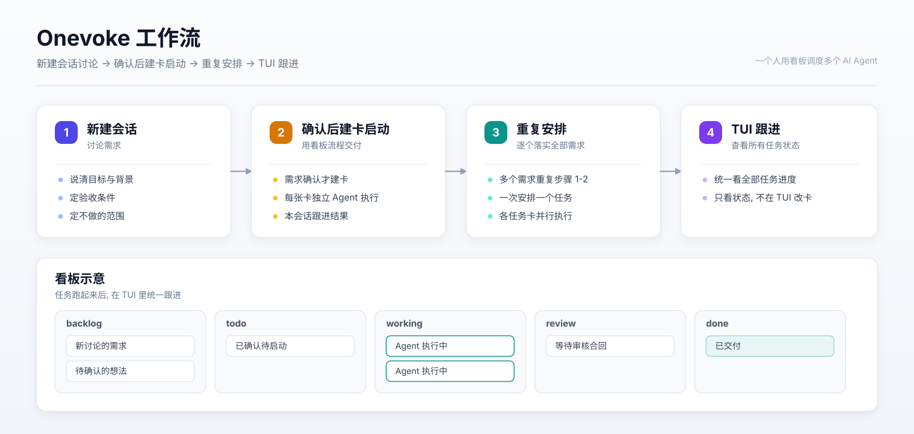
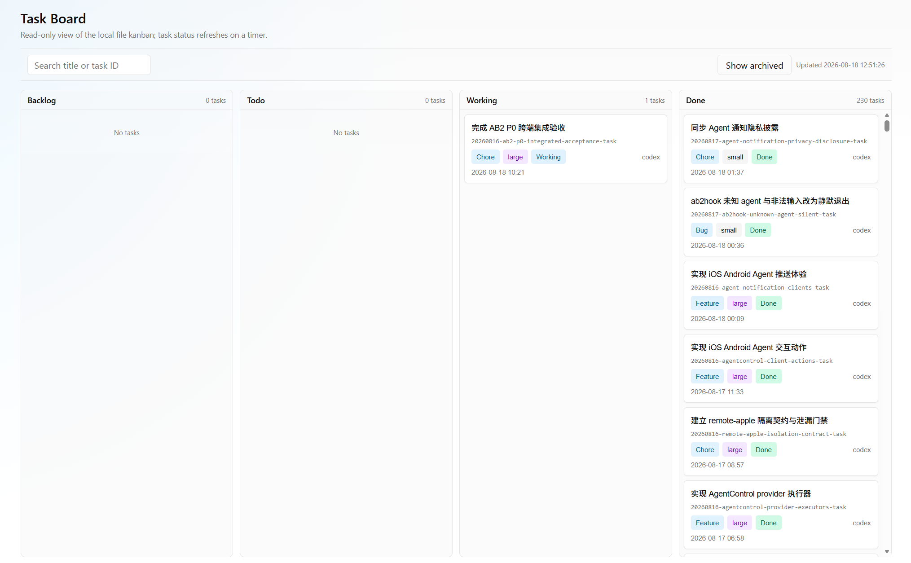
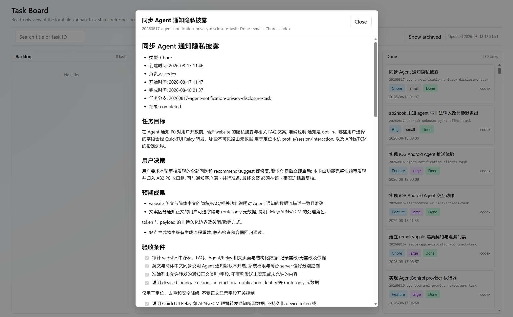
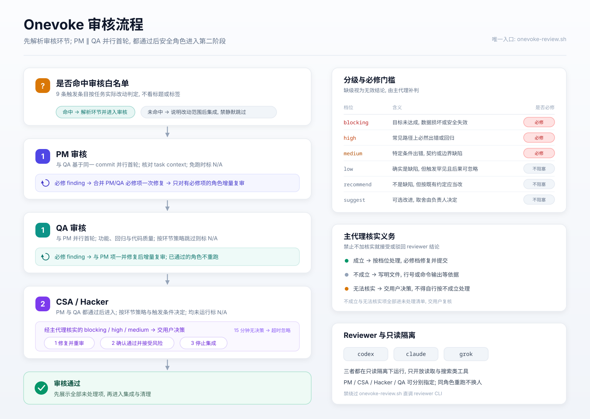

# Onevoke

一个人用看板调度多个 AI Agent.



## 1. 安装

需要 Python 3, Git, POSIX shell, 以及 Codex, Claude 或 Grok 中至少一个.

```sh
./install.sh
```

安装过程会显示当前配置菜单, 可按需修改默认 Agent、各角色 Reviewer、启动方式、模型与推理档位或 MemSearch; 直接回车保存当前值, 输入 `q` 退出且不保存.
审核统一由 `onevoke-review.sh` 执行; 新增 Reviewer 时扩展该入口, 不新增按 Agent 命名的脚本.

如果 `~/.agents/AGENTS.md` 不存在, 安装器会将其链接到 `ONEVOKE-AGENTS.md`; 已有文件不会修改.

如果 welcome 提示 Agent 尚未接入规则:

- Claude: 在 `~/.claude/CLAUDE.md` 加 `@~/.agents/ONEVOKE-AGENTS.md`.
- Codex: 将 `~/.codex/AGENTS.md` 软链接到该入口, 或把入口内容合入现有文件.
- Grok: 将 `~/.grok/AGENTS.md` 软链接到该入口, 或把入口内容合入现有文件.

## 2. 使用

在项目目录首次使用时初始化看板:

```sh
kanban init
```

先在 Agent 中讨论需求, 明确目标, 验收条件和不做的范围.

讨论完成后, 让 Agent 创建并启动任务卡:

```text
需求已确认. 请用 kanban new & start 创建任务卡并启动.
```

Agent 会填完整任务卡, 再执行:

```sh
kanban new feature login-retry 登录重试
kanban pick 20260813-login-retry-task
kanban start 20260813-login-retry-task
```

大型任务由 Agent 拆成多张可并行执行的任务卡, 再按依赖启动.

查看看板状态:

```sh
kanban list
kanban web
kanban tui
kanban tui --single
```

`kanban web` 默认在 `http://127.0.0.1:8080` 启动只读看板. 服务端每 60 秒扫描任务, 仅在数据变化时通过 SSE 推送; 客户端原位更新对应卡片.

`kanban tui` 在当前终端启动只读看板. 默认按终端宽度显示尽可能多的栏目, 每栏默认最小 40 列 (可用 `-`/`=` 调节并记住), 更窄时少显示或按实际宽度显示单栏, 并保证选中栏可见; `--single` 始终只显示一个栏目. 用方向键或 `hjkl` 浏览, `/` 搜索, Enter 查看任务卡, `a` 切换存档栏目, `r` 刷新, `q` 退出. 默认每 30 秒自动刷新, 按任务 ID 原位更新并尽量保留选中项和滚动位置.

看板总览:



点击卡片可查看任务详情:



只看某个状态:

```sh
kanban list working
kanban list done
```

完整规则:

```sh
kanban rules
```

## 3. 审核

任务命中审核白名单后, 由 `onevoke-review.sh` 按 PM -> 安全角色 -> QA 三阶段串行审核, QA 固定在最后; 每次修复只重跑当前阶段. 只有经主代理核实的 `blocking`, `high`, `medium` 必须修复, 其余档位不阻塞集成, 但要在闭环结束时逐项展示.



## 4. 许可

本项目使用 MIT License, 见 [LICENSE](LICENSE).
