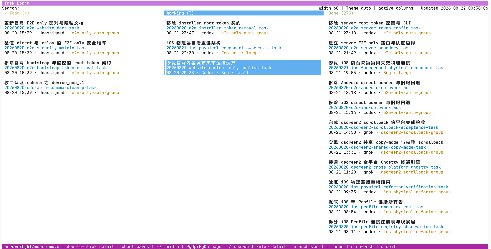

# Onevoke

一个人用看板调度多个 AI Agent.


## 1. 新手指引

安装完成后即可使用.

4 步上手:

1. 新建一个 agent 会话, 在里面讨论需求或者任务, 说清楚目标, 验收条件. 推荐使用 Agent 的 plan 模式.
2. 任务确认后, 在该会话里要求 Agent 用看板流程完成任务:

```text
用 kanban new & start 创建任务卡并启动
```

3. 有多个需求时, 对每个需求重复步骤 1-2, 一次安排一个任务.
4. 用 TUI 查看所有任务的状态:

```sh
kanban tui
```

## 2. 安装

需要 Python 3, Git, 以及 Codex, Claude, Grok 或 Cursor 中至少一个.

Onevoke 有两种安装作用域, 共用同一套规则和程序.

### 2.1 全局安装

macOS/Linux:

```sh
./install.sh
```

Windows (PowerShell):

```powershell
.\install.ps1
```

安装完成后会显示配置菜单, 根据需要配置各个角色要使用的 Agent 和模型.

### 2.2 项目本地安装

macOS/Linux:

```sh
./install.sh --project <项目目录>
```

Windows (PowerShell):

```powershell
.\install.ps1 --project <项目目录>
```

## 3. 常用命令

`kanban tui` 在当前终端启动全功能只读看板, 支持多栏浏览、搜索、任务详情、鼠标操作与剪贴板复制.

终端看板:



Web 看板:

`kanban web` 默认在 `http://127.0.0.1:8080` 启动只读看板.

看板总览:


点击卡片可查看任务详情:


## 4. 许可

本项目使用 MIT License, 见 [LICENSE](LICENSE).
